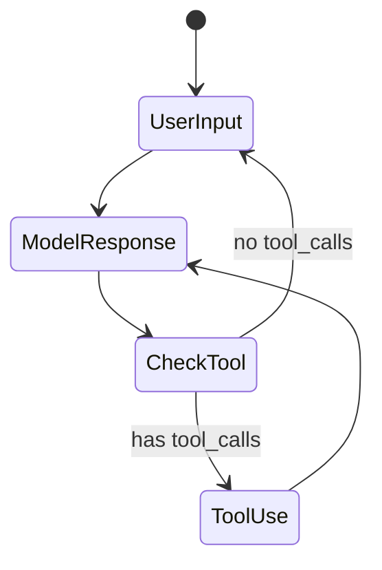

# 🏗️ Architecture Overview

This code generator application follows the same architectural principles as the Claude Code Assistant, adapted for code generation tasks.

## Core Principles

### 1. LangGraph StateGraph Workflow

Just like the reference implementation, we use a clean three-node architecture:

```
User Input → Model Response → Tool Use (conditional) → Model Response → END
```

- **model_response**: Claude Sonnet 4.5 processes user input and decides on tool usage
- **tool_use**: Executes code generation and file operation tools
- **Conditional routing**: Checks if tools are needed before continuing

### 2. Persistent State Management

- **SQLite Checkpointing**: All conversations are saved in `code_generator_checkpoints.db`
- **State persistence**: Enables conversation resume and debugging
- **Thread-based**: Each session maintains its own thread ID

### 3. Tool Integration

The application uses two categories of tools:

#### Code Generation Tools (`tools/code_tools.py`)
- `generate_code`: Signal code generation requests
- `create_project_structure`: Create multi-file projects
- `generate_file`: Generate single files
- `analyze_code`: Analyze and improve existing code
- `generate_tests`: Generate unit tests

#### File Operation Tools (`tools/file_tools.py`)
- `read_file`: Read file contents
- `write_file`: Write files (used extensively for code generation)
- `list_files`: List directory contents
- `create_directory`: Create directory structures
- `search_files`: Search for files by pattern

### 4. Rich Terminal UI

- Beautiful, colorful interface using Rich library
- Emoji-enhanced output
- Panel-based display for responses
- Interactive prompts
- Numbered option selection

### 5. LLM Configuration

- **Model**: Claude Sonnet 4.5 (`claude-sonnet-4-5`)
- **Temperature**: 0.7 (slightly higher for creative code generation)
- **Max Tokens**: 8192 (higher limit for code generation)
- **Tool Binding**: Tools are bound to the LLM for function calling

## Key Differences from Reference

While following the same principles, this application is specialized for code generation:

1. **System Prompt**: Optimized for code generation tasks
2. **Tools**: Focused on code generation rather than general coding assistance
3. **Output Directory**: Defaults to `./generated_code/`
4. **Temperature**: Slightly higher (0.7 vs 0) for more creative code generation
5. **Max Tokens**: Higher limit (8192) to accommodate longer code outputs

## State Flow



## Message Flow

1. User provides natural language description
2. System message is added (first message only)
3. LLM processes input and decides on tool usage
4. If tools needed: execute tools → return to model response
5. If no tools: display final response → return to user input
6. State is checkpointed after each step

## File Structure

```
code-generator/
├── main.py                 # Entry point (async main function)
├── agent.py                # Core agent with StateGraph workflow
├── tools/
│   ├── __init__.py
│   ├── code_tools.py       # Code generation tools
│   └── file_tools.py       # File operation tools
├── pyproject.toml          # Dependencies
├── requirements.txt        # Alternative dependency file
├── README.md              # Main documentation
├── QUICKSTART.md          # Quick start guide
└── ARCHITECTURE.md        # This file
```

## Extensibility

The architecture is designed to be easily extensible:

1. **Add new tools**: Create functions in `tools/` and add to tool lists
2. **Modify workflow**: Add new nodes or edges in `agent.py`
3. **Customize UI**: Modify Rich console output in `agent.py`
4. **Change LLM**: Update model configuration in `agent.__init__()`

## Best Practices Followed

- ✅ Clean separation of concerns (tools, agent, main)
- ✅ Async/await for I/O operations
- ✅ Error handling and graceful degradation
- ✅ Environment variable configuration
- ✅ Type hints throughout
- ✅ Comprehensive documentation
- ✅ SQLite checkpointing for state persistence

