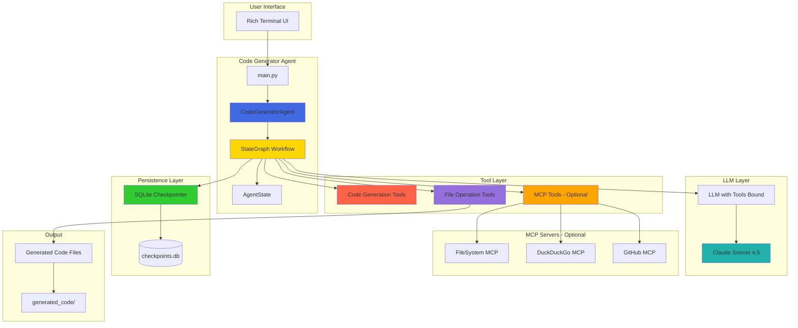
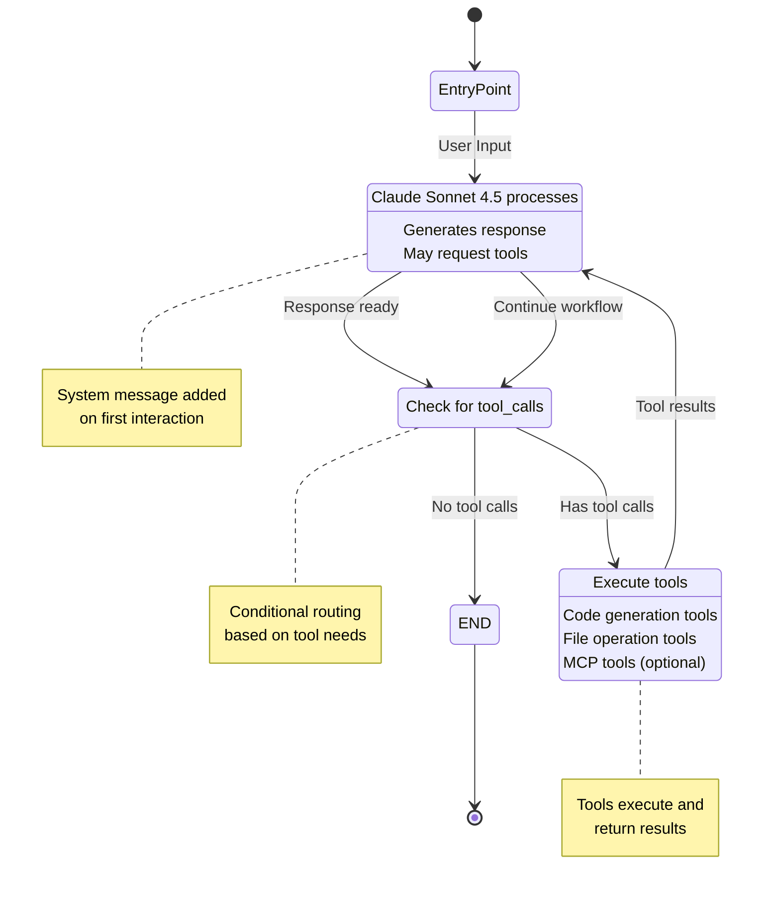
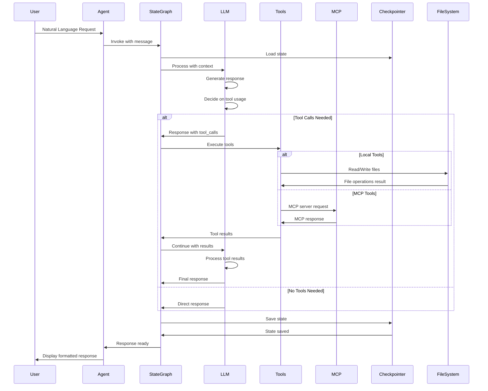
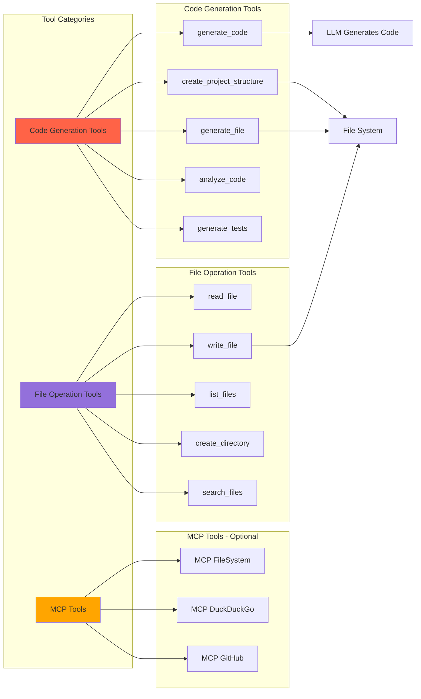
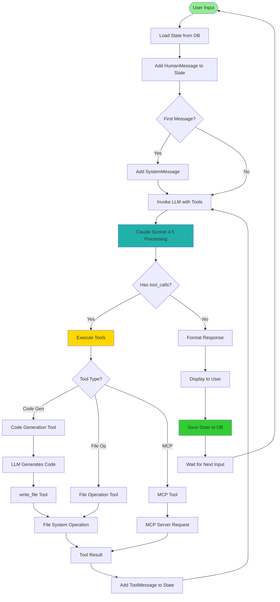
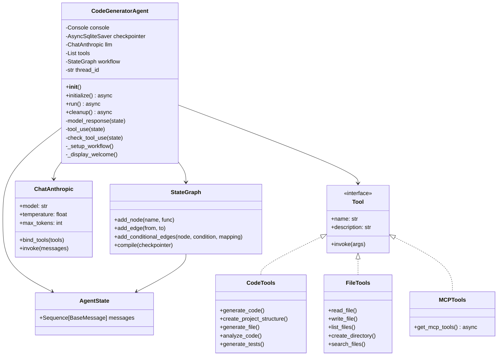
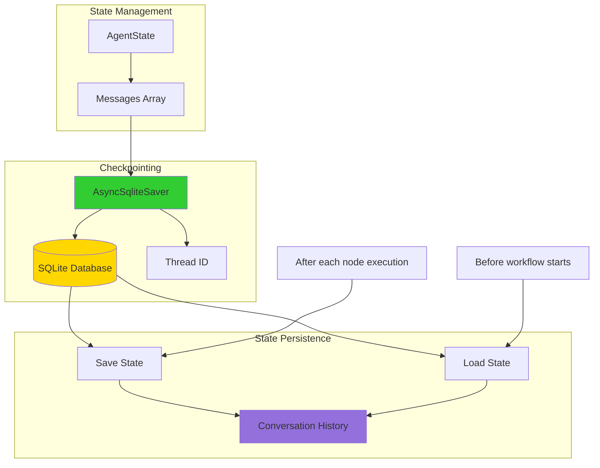
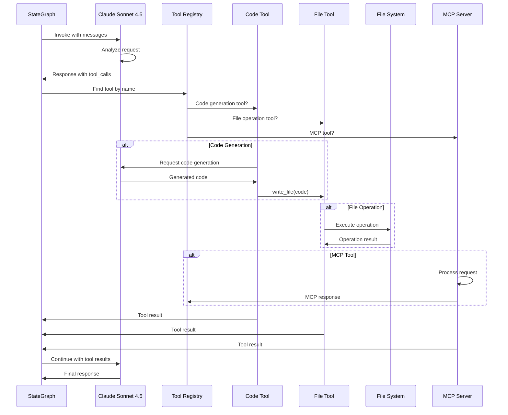
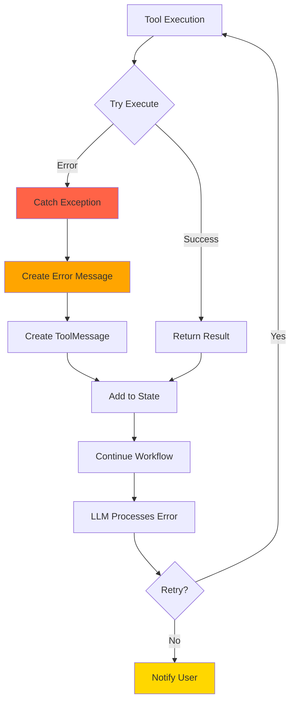

# 🏗️ Complete Architecture Diagram

## System Overview

This document provides a comprehensive architecture diagram explaining the workflow between agents, tools, and MCP servers in the Code Generator application.

## High-Level Architecture

## StateGraph Workflow Detail

## Message Flow Sequence

## Tool Architecture

## Complete Data Flow

## Agent Class Structure

## Checkpointing System

## Tool Execution Flow

## Component Interaction Matrix

| Component | Interacts With | Interaction Type | Purpose |
|-----------|----------------|------------------|---------|
| **User** | Agent | Input/Output | Natural language requests |
| **Agent** | StateGraph | Control | Orchestrates workflow |
| **StateGraph** | LLM | Invocation | Processes messages |
| **StateGraph** | Tools | Execution | Executes tool calls |
| **StateGraph** | Checkpointer | Persistence | Saves/loads state |
| **LLM** | Tools | Binding | Tool function calling |
| **Tools** | File System | I/O | File operations |
| **Tools** | MCP Servers | RPC | External services |
| **Checkpointer** | SQLite DB | Storage | State persistence |

## Error Handling Flow

## Summary

This architecture demonstrates:

1. **Three-Node Workflow**: Model Response → Tool Use → Model Response (conditional)
2. **Tool Integration**: Local tools and optional MCP tools
3. **State Persistence**: SQLite checkpointing for conversation history
4. **LLM Integration**: Claude Sonnet 4.5 with tool binding
5. **Error Handling**: Graceful error handling and recovery
6. **Extensibility**: Easy to add new tools or MCP servers

The system is designed to be:
- **Modular**: Clear separation of concerns
- **Extensible**: Easy to add new tools
- **Persistent**: State saved across sessions
- **Robust**: Error handling at every level
- **Interactive**: Rich terminal UI for user experience

