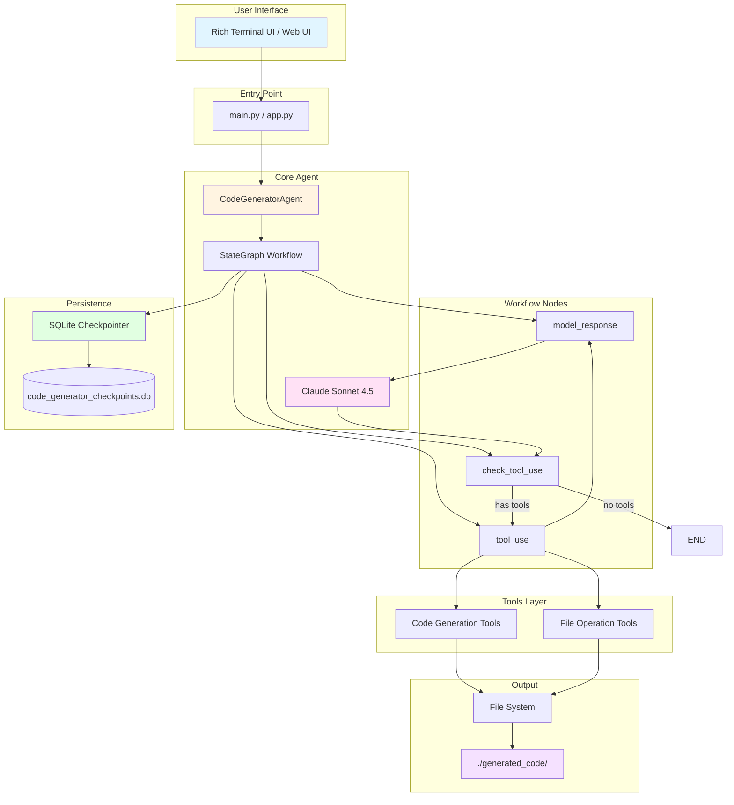
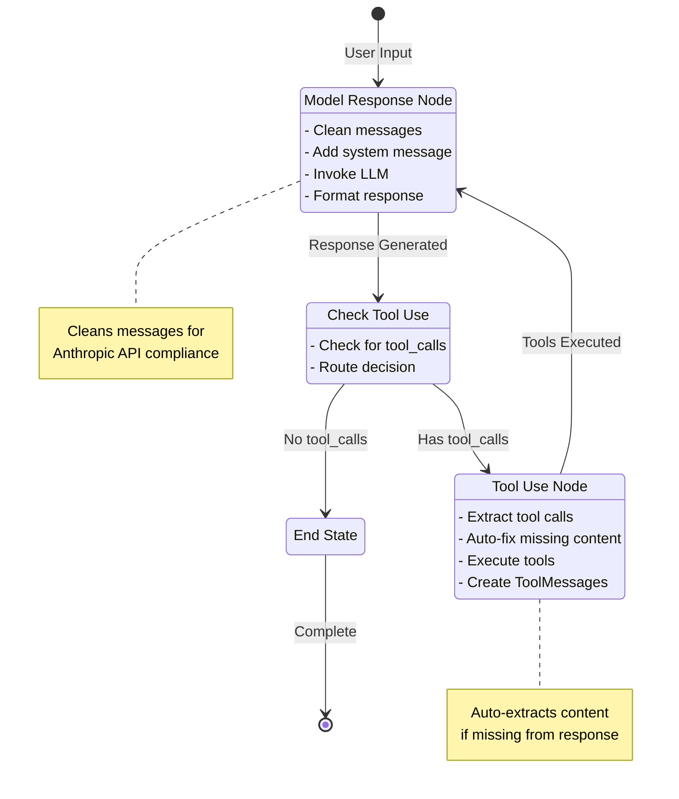
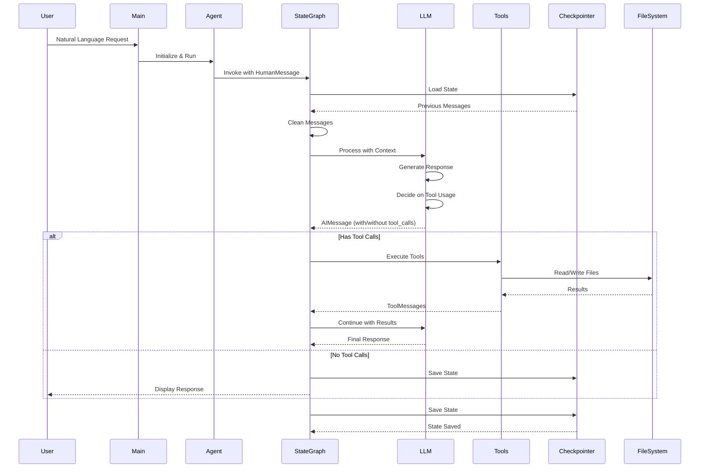
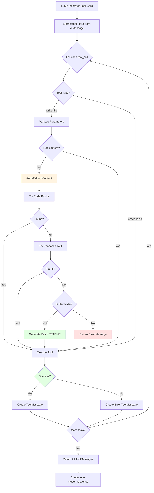
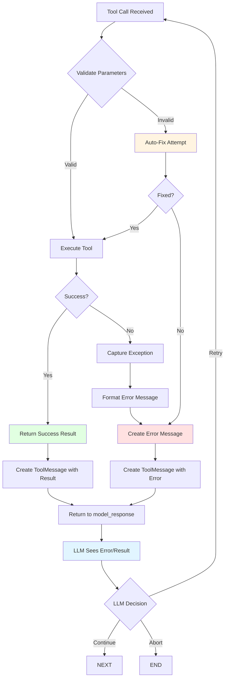
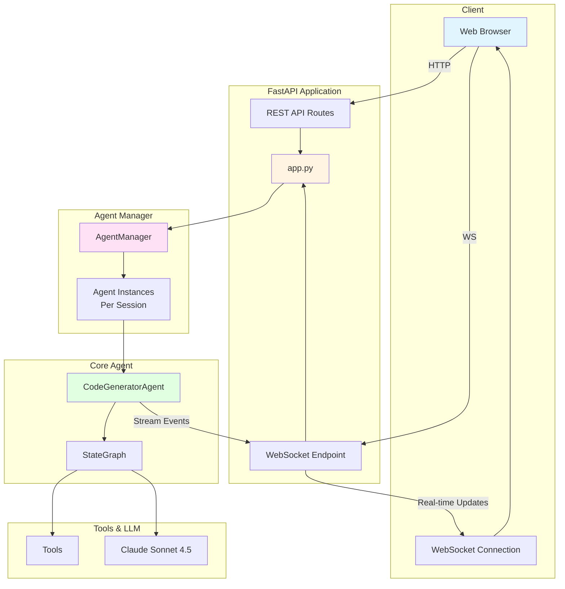
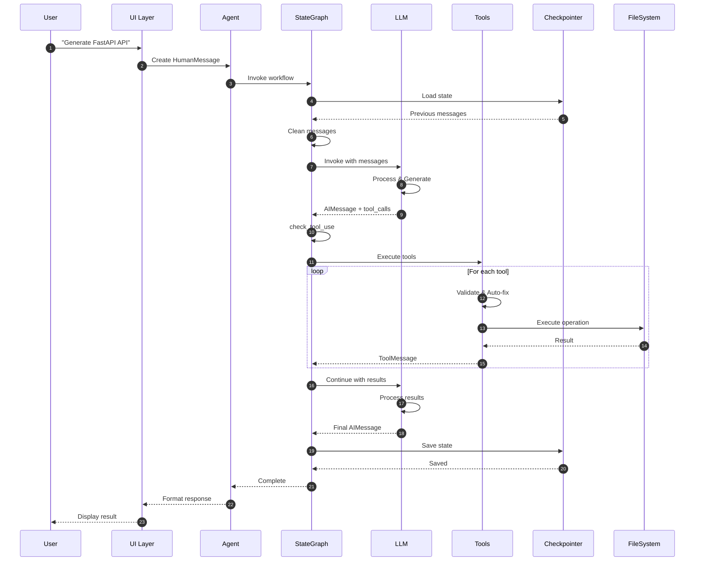

# 📊 Visual Architecture Summary

## Mermaid Flow Diagrams

### 1. Overall System Architecture



### 2. StateGraph Workflow Flow



### 3. Message Flow Sequence



### 4. Tool Execution Flow



### 5. State Persistence Flow

```mermaid
flowchart LR
    subgraph "Agent State"
        STATE[AgentState<br/>messages: Sequence[BaseMessage]]
    end
    
    subgraph "Checkpointer"
        CP[AsyncSqliteSaver]
        THREAD[Thread ID<br/>code_generator_session]
    end
    
    subgraph "Database"
        DB[(SQLite DB<br/>code_generator_checkpoints.db)]
        TABLES[Tables:<br/>• checkpoints<br/>• writes]
    end
    
    STATE -->|Save State| CP
    CP -->|Store| THREAD
    THREAD -->|Persist| DB
    DB --> TABLES
    
    DB -->|Load State| CP
    CP -->|Restore| STATE
    
    style STATE fill:#e1f5ff
    style CP fill:#fff4e1
    style DB fill:#e1ffe1
```

### 6. Error Handling & Recovery Flow



### 7. Web Application Architecture (app.py)



### 8. Complete Request Lifecycle



## Quick Reference Diagram

```
┌─────────────────────────────────────────────────────────────────┐
│                    USER INTERFACE (Rich Terminal)               │
└────────────────────────────┬────────────────────────────────────┘
                              │
                              ▼
┌─────────────────────────────────────────────────────────────────┐
│                      MAIN.PY (Entry Point)                      │
│  • Load .env                                                    │
│  • Create output directory                                      │
│  • Initialize agent                                             │
└────────────────────────────┬────────────────────────────────────┘
                              │
                              ▼
┌─────────────────────────────────────────────────────────────────┐
│              CODEGENERATORAGENT (Core Agent)                     │
│  ┌──────────────────────────────────────────────────────────┐  │
│  │  StateGraph Workflow                                      │  │
│  │  ┌──────────────┐    ┌──────────────┐    ┌──────────────┐ │  │
│  │  │ model_       │───▶│ check_      │───▶│ tool_       │ │  │
│  │  │ response     │    │ tool_use    │    │ use         │ │  │
│  │  └──────┬───────┘    └─────────────┘    └──────┬───────┘ │  │
│  │         │                                        │          │  │
│  │         └──────────────────────────────────────┘          │  │
│  └──────────────────────────────────────────────────────────┘  │
│                                                                   │
│  ┌──────────────────────────────────────────────────────────┐  │
│  │  Claude Sonnet 4.5 (LLM)                                  │  │
│  │  • Temperature: 0.7                                        │  │
│  │  • Max Tokens: 8192                                        │  │
│  │  • Tools Bound: Yes                                        │  │
│  └──────────────────────────────────────────────────────────┘  │
└────────────────────────────┬────────────────────────────────────┘
                              │
                              ▼
┌─────────────────────────────────────────────────────────────────┐
│                         TOOL LAYER                               │
│  ┌──────────────────────┐  ┌──────────────────────┐           │
│  │  Code Generation      │  │  File Operations     │           │
│  │  • generate_code      │  │  • read_file        │           │
│  │  • create_project_   │  │  • write_file       │           │
│  │    structure          │  │  • list_files       │           │
│  │  • generate_file      │  │  • create_directory│           │
│  │  • analyze_code       │  │  • search_files    │           │
│  │  • generate_tests     │  │                     │           │
│  └──────────────────────┘  └──────────────────────┘           │
│                                                                   │
│  ┌──────────────────────┐                                      │
│  │  MCP Tools (Optional)│                                      │
│  │  • FileSystem MCP     │                                      │
│  │  • DuckDuckGo MCP     │                                      │
│  │  • GitHub MCP         │                                      │
│  └──────────────────────┘                                      │
└────────────────────────────┬────────────────────────────────────┘
                              │
                              ▼
┌─────────────────────────────────────────────────────────────────┐
│                    PERSISTENCE LAYER                             │
│  ┌──────────────────────────────────────────────────────────┐  │
│  │  SQLite Checkpointer                                      │  │
│  │  • Thread ID: code_generator_session                      │  │
│  │  • Saves: All messages, state, metadata                   │  │
│  │  • File: code_generator_checkpoints.db                   │  │
│  └──────────────────────────────────────────────────────────┘  │
└────────────────────────────┬────────────────────────────────────┘
                              │
                              ▼
┌─────────────────────────────────────────────────────────────────┐
│                      OUTPUT LAYER                                │
│  ┌──────────────────────────────────────────────────────────┐  │
│  │  Generated Code Files                                      │  │
│  │  • Location: ./generated_code/                            │  │
│  │  • Format: Python, JavaScript, etc.                        │  │
│  │  • Structure: Organized by project                        │  │
│  └──────────────────────────────────────────────────────────┘  │
└─────────────────────────────────────────────────────────────────┘
```

## Message Flow Visualization

```
┌─────────┐
│  USER   │
└────┬────┘
     │ "Generate FastAPI API"
     ▼
┌─────────────────────────────────────┐
│  HumanMessage                       │
│  content: "Generate FastAPI API"   │
└────┬───────────────────────────────┘
     │
     ▼
┌─────────────────────────────────────┐
│  StateGraph: model_response         │
│  ┌───────────────────────────────┐ │
│  │ Add SystemMessage (if first)  │ │
│  │ Invoke LLM with messages      │ │
│  └───────────────────────────────┘ │
└────┬───────────────────────────────┘
     │
     ▼
┌─────────────────────────────────────┐
│  AIMessage                          │
│  content: "I'll generate..."        │
│  tool_calls: [                      │
│    {name: "generate_code", ...},    │
│    {name: "write_file", ...}        │
│  ]                                  │
└────┬───────────────────────────────┘
     │
     ▼
┌─────────────────────────────────────┐
│  StateGraph: tool_use               │
│  ┌───────────────────────────────┐ │
│  │ Execute generate_code         │ │
│  │ Execute write_file            │ │
│  └───────────────────────────────┘ │
└────┬───────────────────────────────┘
     │
     ▼
┌─────────────────────────────────────┐
│  ToolMessage(s)                     │
│  content: "Code generated..."       │
│  tool_call_id: "..."                │
└────┬───────────────────────────────┘
     │
     ▼
┌─────────────────────────────────────┐
│  StateGraph: model_response         │
│  ┌───────────────────────────────┐ │
│  │ LLM processes tool results     │ │
│  │ Generates final response      │ │
│  └───────────────────────────────┘ │
└────┬───────────────────────────────┘
     │
     ▼
┌─────────────────────────────────────┐
│  AIMessage                          │
│  content: "I've created..."         │
│  tool_calls: [] (none)              │
└────┬───────────────────────────────┘
     │
     ▼
┌─────────────────────────────────────┐
│  Checkpointer: Save State           │
│  ┌───────────────────────────────┐ │
│  │ Save all messages to DB       │ │
│  │ Update checkpoint             │ │
│  └───────────────────────────────┘ │
└────┬───────────────────────────────┘
     │
     ▼
┌─────────┐
│  USER   │
│  (sees formatted response)          │
└─────────┘
```

## Tool Execution Flow

```
┌─────────────────────────────────────────────────────────┐
│  LLM Decides: Need Tools                                │
└────────────────────┬────────────────────────────────────┘
                      │
                      ▼
┌─────────────────────────────────────────────────────────┐
│  Extract tool_calls from AIMessage                      │
│  [                                                       │
│    {name: "generate_code", args: {...}},                │
│    {name: "write_file", args: {...}}                    │
│  ]                                                       │
└────────────────────┬────────────────────────────────────┘
                      │
                      ▼
        ┌─────────────┴─────────────┐
        │                           │
        ▼                           ▼
┌───────────────┐         ┌───────────────┐
│ Code Tool     │         │ File Tool     │
│ generate_code │         │ write_file    │
└───────┬───────┘         └───────┬───────┘
        │                         │
        │                         │
        ▼                         ▼
┌───────────────┐         ┌───────────────┐
│ LLM Generates │         │ File System   │
│ Code          │         │ Write File    │
└───────┬───────┘         └───────┬───────┘
        │                         │
        └─────────┬───────────────┘
                  │
                  ▼
        ┌─────────────────────┐
        │ ToolMessage Results  │
        │ [                    │
        │   "Code: def api..."  │
        │   "File written: ✓"   │
        │ ]                    │
        └─────────────────────┘
                  │
                  ▼
        ┌─────────────────────┐
        │ Return to LLM       │
        │ (Continue workflow)  │
        └─────────────────────┘
```

## State Persistence Flow

```
┌─────────────────────────────────────────────────────────┐
│  AgentState                                             │
│  ┌───────────────────────────────────────────────────┐ │
│  │ messages: [                                        │ │
│  │   SystemMessage("You are..."),                    │ │
│  │   HumanMessage("Generate API"),                   │ │
│  │   AIMessage("I'll generate..."),                 │ │
│  │   ToolMessage("Code generated..."),                │ │
│  │   AIMessage("Done!")                               │ │
│  │ ]                                                  │ │
│  └───────────────────────────────────────────────────┘ │
└────────────────────┬────────────────────────────────────┘
                      │
                      ▼
┌─────────────────────────────────────────────────────────┐
│  AsyncSqliteSaver                                       │
│  ┌───────────────────────────────────────────────────┐ │
│  │ Thread ID: "code_generator_session"                │ │
│  │ Checkpoint ID: "abc123..."                         │ │
│  │ Save: messages, metadata, timestamps              │ │
│  └───────────────────────────────────────────────────┘ │
└────────────────────┬────────────────────────────────────┘
                      │
                      ▼
┌─────────────────────────────────────────────────────────┐
│  SQLite Database                                      │
│  ┌───────────────────────────────────────────────────┐ │
│  │ code_generator_checkpoints.db                      │ │
│  │                                                    │ │
│  │ Tables:                                           │ │
│  │  • checkpoints                                    │ │
│  │  • writes                                         │ │
│  │                                                    │ │
│  │ Enables:                                          │ │
│  │  • Conversation resume                           │ │
│  │  • Debugging                                     │ │
│  │  • State inspection                              │ │
│  └───────────────────────────────────────────────────┘ │
└─────────────────────────────────────────────────────────┘
```

## Component Interaction Matrix

```
┌─────────────┬──────────────┬──────────────┬──────────────┬──────────────┐
│ Component   │ Interacts    │ Interaction  │ Data Flow    │ Purpose      │
│             │ With         │ Type         │              │              │
├─────────────┼──────────────┼──────────────┼──────────────┼──────────────┤
│ User        │ Agent        │ I/O          │ Text         │ Requests     │
│ Agent       │ StateGraph   │ Control      │ State        │ Orchestrate  │
│ StateGraph  │ LLM          │ Invoke       │ Messages     │ Process      │
│ StateGraph  │ Tools        │ Execute      │ Args/Results │ Execute      │
│ StateGraph  │ Checkpointer │ Persist      │ State        │ Save/Load    │
│ LLM         │ Tools        │ Bind         │ Functions    │ Tool Calling │
│ Tools       │ FileSystem   │ I/O          │ Files        │ Operations   │
│ Tools       │ MCP Servers  │ RPC          │ Requests     │ External     │
│ Checkpointer│ SQLite       │ Storage      │ State        │ Persistence  │
└─────────────┴──────────────┴──────────────┴──────────────┴──────────────┘
```

## Error Handling Flow

```
┌─────────────────────────────────────────────────────────┐
│  Tool Execution                                         │
└────────────────────┬────────────────────────────────────┘
                      │
        ┌─────────────┴─────────────┐
        │                           │
        ▼                           ▼
┌───────────────┐         ┌───────────────┐
│ Success       │         │ Error         │
│ Return Result │         │ Catch Exception│
└───────┬───────┘         └───────┬───────┘
        │                         │
        │                         ▼
        │              ┌─────────────────┐
        │              │ Create Error     │
        │              │ ToolMessage      │
        │              └────────┬────────┘
        │                         │
        └─────────┬───────────────┘
                  │
                  ▼
        ┌─────────────────────┐
        │ Add to State        │
        │ Continue Workflow   │
        └──────────┬──────────┘
                   │
                   ▼
        ┌─────────────────────┐
        │ LLM Processes       │
        │ (Error or Success)  │
        └─────────────────────┘
```

## Key Design Patterns

### 1. StateGraph Pattern
- **Purpose**: Manage workflow state
- **Implementation**: Three-node graph with conditional routing
- **Benefits**: Clear flow, easy to extend

### 2. Tool Binding Pattern
- **Purpose**: Enable LLM function calling
- **Implementation**: Tools bound to LLM via `bind_tools()`
- **Benefits**: LLM can intelligently choose tools

### 3. Checkpointing Pattern
- **Purpose**: Persist conversation state
- **Implementation**: SQLite-based async checkpointing
- **Benefits**: Resume conversations, debugging

### 4. Message Pattern
- **Purpose**: Standardize communication
- **Implementation**: LangChain message types
- **Benefits**: Type safety, consistency

### 5. Tool Registry Pattern
- **Purpose**: Manage available tools
- **Implementation**: Tool lists in separate modules
- **Benefits**: Modularity, easy to extend

## Performance Metrics

```
┌─────────────────────────────────────────────────────────┐
│  Typical Request Flow Timing                             │
├─────────────────────────────────────────────────────────┤
│  User Input Processing:        < 0.1s                    │
│  State Load:                   < 0.1s                   │
│  LLM Processing:               2-10s                    │
│  Tool Execution:               < 1s (local)              │
│  Tool Execution (MCP):         1-5s                     │
│  State Save:                   < 0.1s                   │
│  Response Formatting:          < 0.1s                   │
├─────────────────────────────────────────────────────────┤
│  Total (typical):              5-30s                    │
│  Total (complex):              30-60s                    │
└─────────────────────────────────────────────────────────┘
```

## Scalability Considerations

```
┌─────────────────────────────────────────────────────────┐
│  Current Architecture: Single-threaded, async           │
│  • One user per process                                 │
│  • Thread-based state isolation                         │
│  • SQLite for persistence                               │
├─────────────────────────────────────────────────────────┤
│  Scaling Options:                                       │
│  • Multiple processes (process pool)                    │
│  • Distributed state (Redis/PostgreSQL)                  │
│  • Load balancing (multiple agents)                      │
│  • Caching (frequently used code patterns)              │
└─────────────────────────────────────────────────────────┘
```

